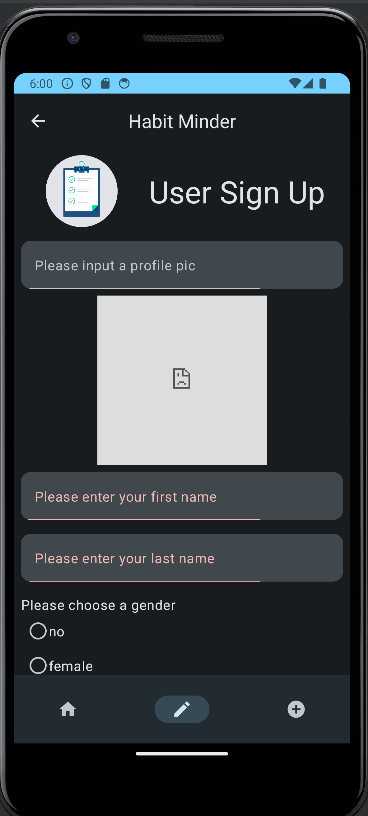
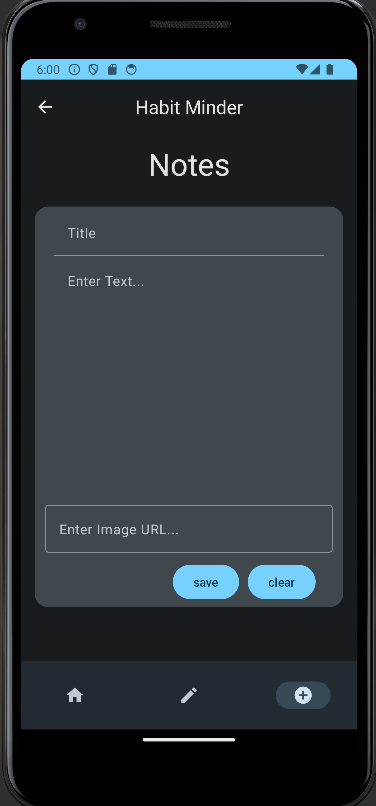

# Habit Minder : A Tracker App

## Goal
Our application is a habit tracker app. Users must create an account to use it. They can then add any habits that they want to keep track of. They can also categorize them, making it easy for them to see which aspects of their life they are actively improving. In addition, the app also offers a space where users can write out their thoughts about their progress. Whether it's for their health, fitness, productivity or another reason, our app is dedicated for the users and their well-being. 

## Quick-start
- To run the our app, make sure to have Android Studio installed in the machine (https://developer.android.com/studio).
- Download the project ZIP file in the release section and unzip it.
- Start Android Studio and open the project.
- Run the application

## Screenshots of application
### About Page

### Sign Up Page

### Notes Page

## Team members
- Cindy Coulibaly (cindycoulibaly10@gmail.com)
- Jean Rose Manigbas (manigbas.jn@gmail.com)
- Anjeli Mae Taruc (anjelitaruc02@gmail.com)

